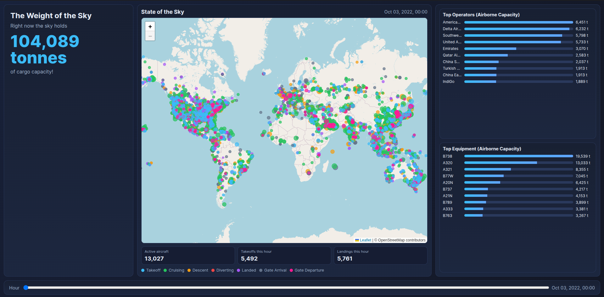
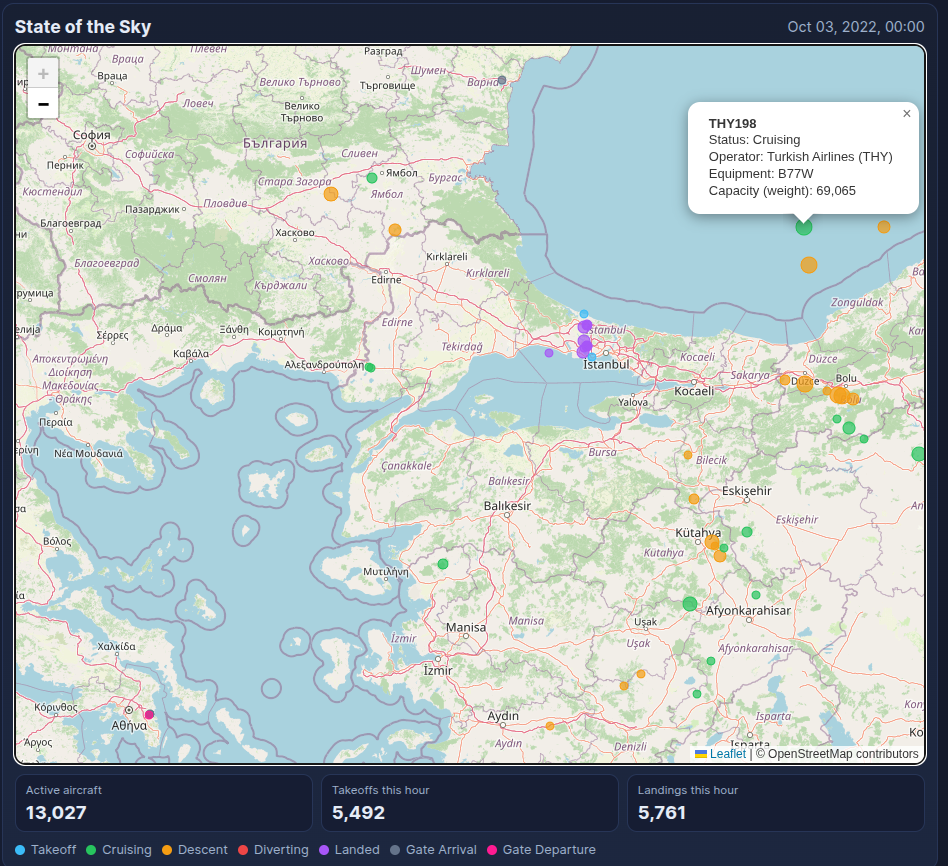

# Data Task For Rotate: State of the Sky
This document explains what has been done for the Rotate data analysis assignment, and gets its name from the tool built to answer Question 3.

## How to Run (Concerns Q3 of the assignment)

 ### Option A: Quick Run                                                                             
 ```bash             
   cd web         
   python -m http.server 8000                                                                
 ``` 
 Open: http://127.0.0.1:8000                                                                                    
 This uses pre-generated files in:                                                       
 - web/data/hourly_stats.json                                                             
 - web/data/snapshots/*.geojson                                                                                                                                         
 ### Option B: Rebuild dashboard data from raw inputs                                   
 Requirements:                                                                   
 - Python 3.10+                                                                       
 - duckdb package                                                                            
 ```bash                                                                                
   pip install duckdb  
   python src/state_of_the_sky.py --date 2022-10-03                                                   
   # or to include all days:     
   # python src/state_of_the_sky.py --all-days                                                                                                                       
 ```                                                                             
 Then run:                                                                             
 ```bash                                                                                 
   cd web                                                                                
   python -m http.server 8000 
```

## Optional:  Rebuild Q1/Q2 Tables
```bash
python src/table_setup.py
```
Creates/updates `db/flight_events.duckdb` with the following tables:
- `flight_events` : Raw CSV events with cleaned types and `flight_timestamp`.
- `flights` : One representative row per `flight_id` (earliest observed event).
- `airplane_details_dedup` : One aircraft reference row per `code_icao` after deduping.
- `flight_capacity` : Flight-level table with joined capacity (`weight`/`volume`) and `match_status`.
- `capacity_data_quality_summary`: Counts and percentages by capacity match-quality category.

 ### CLI Options
- `--data-glob`: Glob for flight event CSV files (default: data/*.csv)
- `--aircraft-json`: Path to airplane details NDJSON file (default: data/airplane_details.json)
- `--output-dir`: Directory for generated artifacts (default: web/data)
- `--date`: Single date to process (YYYY-MM-DD). If omitted, uses first date in data.
- `--all-days`: Generate snapshots for all days in the dataset.
- `--top-n`: How many top operators/equipment entries to keep per hour.

## Why DuckDB?
DuckDB was a good fit for this project as it allows SQL query runs directly on local files (CSV/NDJSON) with typed columns, window functions, and fast aggregations, all in one engine, without the need for a separate database service setup.

## Explicit Answers to Assignment Questions
### Question 1

I loaded the raw CSV files into DuckDB and created a cleaned table for analysis, which has explicit data types. 
* Dates are stored as DATE, times as TIME, and are combined into event times as a TIMESTAMP.
* Identifiers such as airport and aircraft codes are left as VARCHAR.
* Quantitative fields such as altitude, latitude, and longitude are cast to DOUBLE
* Flight ID is a BIGINT.

These choises of datatypes make filtering, joins, aggregations, and general analyses easier than working with raw CSV strings directly.

 #### Files useful for this question (the notebook more so than the script):
 - [`notebooks/flight_events_exploration.ipynb`](./notebooks/flight_events_exploration.ipynb) : Used to get a feel for the data structure and what its shortcomings are.
 - [`src/table_setup.py`](./src/table_setup.py) : Main `DuckDB` table creation script.

### Question 2

 #### Files useful for this question (the notebook more so than the script):
 - [`notebooks/data_visualisation.ipynb`](./notebooks/data_visualisation.ipynb) : Used to test stuff before join to create the table `flight_capacity`, and to verify the successful creation of `flight_capacity`.
 - [`src/table_setup.py`](./src/table_setup.py) : Main `DuckDB` table creation script.

First, the event-level table was converted into a flight-level table by selecting one representative row per `light_id`, because multiple rows in the source data correspond to different events of the same flight (I did not choose a specific flight event as it might be missing). Each flight was then joined with the airplane details JSON using the aircraft equipment code.

**Note:** The resulting capacity is of course the maximum aircraft-type capacity, not actual cargo loaded on that flight as I cannot predict that when not given the passenger load, how much of the capacity is used up by fuel etc. (For fuel specifically I need *average fuel burn* and calculate what is needed on the given flight route).

Leisure (small) aircraft like the Cessna 172 (C172) and the Piper PA28 (P28A) have very high flight volumes yet they do not carry any cargo (at least not more than a couple of suitcases). These were left with `capacity = null`, as assuming 0 would also be incorrect.

The JSON for `airplane_details` contains duplicate `code_iaco` values for different aircraft (`DC10` for both MD10 and D10-10F, `T204` for Tu-204 / Tu-214 / Tu-204 Freighter, `L101` for both passenger and freighter varieties of the Tristar). Even though there are very few of these aircraft still flying in 2022, this required me to do deduping before joining with the CSV derived flight data to get the capacity table. The JSON also fails to give units for the `payload` and `volume` fields, but I am assuming `kg` and `m^3` respectively.

To account for some models not having data for `volume`, I have also added a `match_status` column which can assume one of the following 4 values: `matched_full` for models that have `volume` data, `matched_no_volume` for those who don't, `missing_equipment` for flights with no specified equipment, and `no_data_on_equipment` for flights that use equipment without capacity data in `airplane_details`.

#### Data Quality Summary
The pipeline creates `capacity_data_quality_summary`, which reports counts and percentages of flights by quality category (`total_flights`, `matched_full`, `matched_no_volume`, `missing_equipment`, `no_data_on_equipment`). A copy of this can be seen below:

   | Metric | Flights | % of Flights |                          
   |--------|--------:|---------------:|
   | total_flights        | 202407  | 100.00         |                                                       
   | matched_full         | 105461  | 52.10          |                                                    
   | matched_no_volume    | 625     | 0.31           |                                                    
   | missing_equipment    | 3586    | 1.77           |                                             
   | no_data_on_equipment | 92735   | 45.82 |

### Question 3

This is the core of the repository, the `State of the Sky` project. This is a dashboard for visualising the current cargo capacity airborne (using the limited data available). Each dot represents the most up-to-date event known of that specific flight, and the size of the dot is proportional to the cargo capacity (in terms of payload) of the airplane being used. The map data is built using the `geojson` library and projected on top of a map from `OpenStreetMap`.

#### Screenshots



 #### How to use:
 - Use slider at the bottom to change the hour of the day.
 - Click on dots to see details about the flight.
 - Zoom in/out on the map using your scroll wheel or the `+/-` buttons on the top left corner.
 - Hover over rows in the `Top Operators` table to see full names of the airlines (if available).
 

 #### Why this?

Initially, I wanted to try and create a predictive model from the data (as written in the third suggestion in the assignment description), but I decided that the predictions would not be insightful given the limited available data. So I made this fun dashboard that can be scaled up with more data.

**Disclaimer:** Parts of the webpage produced for this section of the assignment have been vibe-coded.
